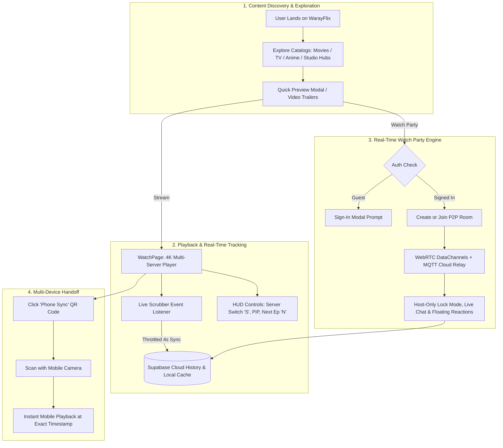

# 🎬 WarayFlix — How It Works & Architecture Guide

A minimalist, high-performance streaming web application built with **React**, **Vite**, **Tailwind CSS**, **Supabase**, and **WebRTC**.

---

## 🗺️ System & User Flow



---

## 🚀 How It Works: Core Workflows

### 1. ⚡ Multi-Server Playback & Exact Scrubber Resume
- **Multi-Server Engine**: If a streaming server encounters high traffic or buffering, users can switch servers instantly via the HUD or by pressing the **"S"** hotkey.
- **Scrubber Tracking**: Listens directly to player progress events (`timeupdate`, `MEDIA_PROGRESS`) without triggering React re-render loops.
- **Auto-Resume**: Playback timestamps are saved every 4 seconds to Supabase and `localStorage`, allowing users to resume watching right where they left off on any device.

### 2. 👥 Real-Time P2P Watch Party
- **Multi-Tier Communication**: Uses WebRTC DataChannels for low-latency peer-to-peer communication with MQTT cloud relay fallbacks.
- **Host-Only Lock Mode**: When enabled, only the room host can pause, play, seek, or change servers, preventing accidental interruptions.
- **Interactive Room**: Real-time text messaging and floating animated emoji reactions for synchronized viewing sessions.
- **Auth Guarded**: Authenticated users can host or join rooms, with sessions saved to Supabase.

### 3. 📱 QR Code Mobile Handoff (Phone Sync)
- **1-Tap Sync**: Clicking the **"Phone Sync"** button on the video player HUD generates a dynamic QR code containing the exact media ID, season, episode, and playback timestamp.
- **Instant Continuation**: Scanning the QR code with any smartphone camera opens the stream on mobile at the exact second.

### 4. 🪟 Picture-in-Picture Floating Mini-Player
- Allows users to minimize active streams into a floating corner player (`PlayerContext`) while navigating menus, browsing movie sagas, or searching for new titles.

### 5. 📺 TV Binge Drawer & Keyboard Shortcuts
- **Episode Drawer**: A sliding drawer interface for fast navigation across multiple seasons and episodes.
- **Hotkeys**:
  - `N` — Instantly jump to the Next Episode.
  - `S` — Cycle between streaming servers.

### 6. 🏰 Studio Hubs & Franchise Sagas
- **Studio Vaults**: Dedicated catalog hubs with authentic vector branding for Netflix, Disney+, Apple TV+, HBO Max, Prime Video, Marvel, A24, Paramount+, and Crunchyroll.
- **Franchise Collections**: Chronological viewing orders for major cinematic universes (MCU, Harry Potter, Star Wars, etc.).

---

## 🛠️ Tech Stack & Architecture

| Layer | Technology |
|---|---|
| **Framework & Build** | React 19, Vite 8 |
| **Styling & UI** | Tailwind CSS 4, Lucide React Icons, Custom Dark Theme |
| **Backend & Cloud Sync** | Supabase (PostgreSQL Auth & Database Sync) |
| **Real-Time Sync** | WebRTC (PeerJS), MQTT Relay |
| **Metadata API** | The Movie Database (TMDB API) |
| **Testing** | Vitest, React Testing Library, jsdom (53+ unit/integration tests) |
| **Deployment** | Vercel |

---

## 📂 Project Architecture

```
src/
├── components/
│   ├── common/             # Reusable UI (MediaCard, MediaGrid, GenreFilterPills, SortDropdown, PageLoader, EmptyState)
│   ├── party/              # Watch Party (PartyHeader, PartyChatDrawer, PartyReactionsOverlay)
│   ├── player/             # WatchPage HUD (WatchTopHUD, EpisodeDrawer, ServerSwitcher, GuestNudgeBanner)
│   └── ...                 # Navbar, Hero, MediaRow, Modals
├── config/                 # siteConfig (players, TMDB API, branding)
├── constants/              # Studio hubs, franchise metadata
├── context/                # AuthContext (Supabase auth), PlayerContext (PiP engine)
├── hooks/                  # useWatchParty, usePlaylist, useDocumentTitle
├── pages/                  # WatchPage, DetailPage, WatchPartyPage, Movies, TVShows, AnimePage, CollectionPage, WatchlistPage, SearchPage, NetworkHubPage
├── services/               # storageService (Supabase + localStorage), tmdb (API fetchers), supabase (client)
├── test/                   # Unit & integration test suites
└── utils/                  # formatters (time, rating, duration, metadata)
```

---

## 🧪 Testing

Run the automated test suite:
```bash
npm run test
```

Build for production:
```bash
npm run build
```

---

## 🌐 Live Application
- **URL**: [https://waray-flix.vercel.app](https://waray-flix.vercel.app)
- **Recommended Browser**: Brave Browser (for ad-free embedded streaming)

